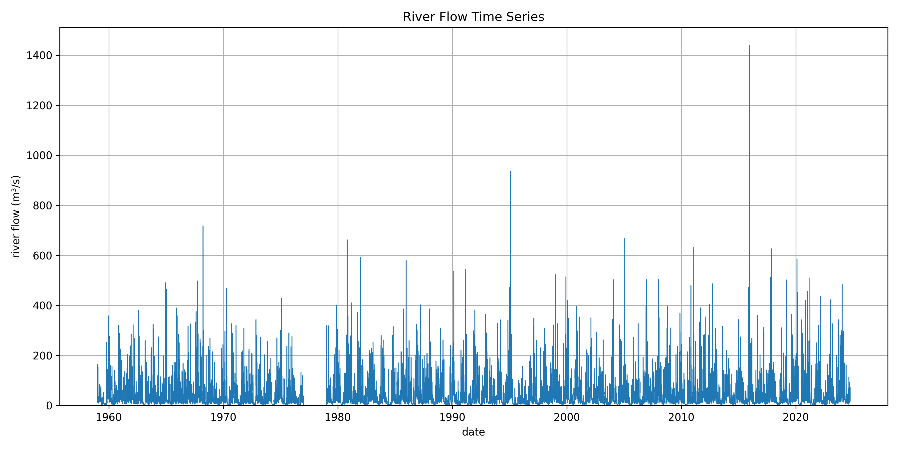
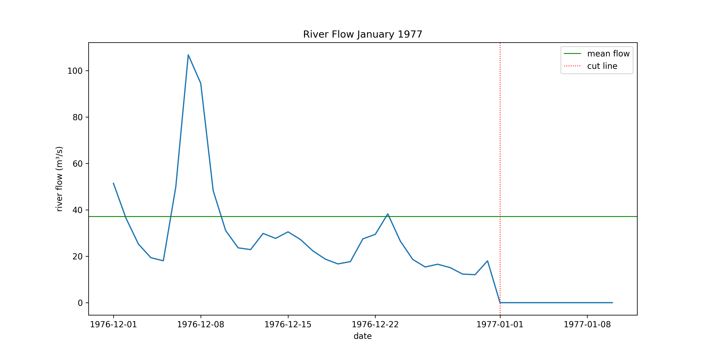
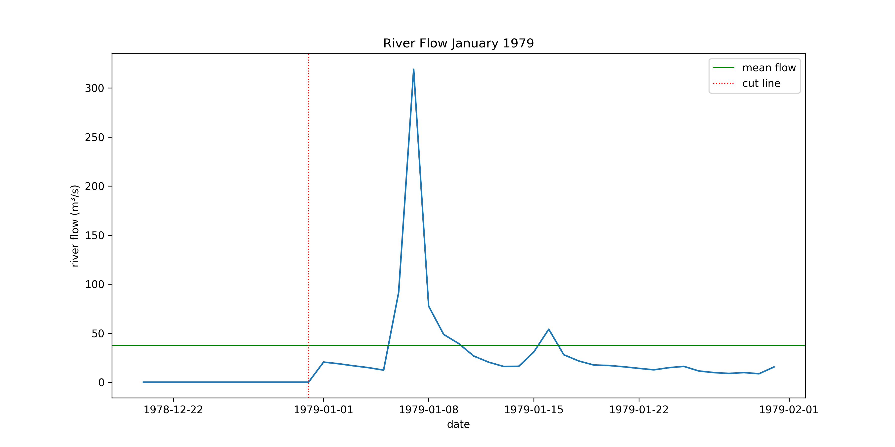
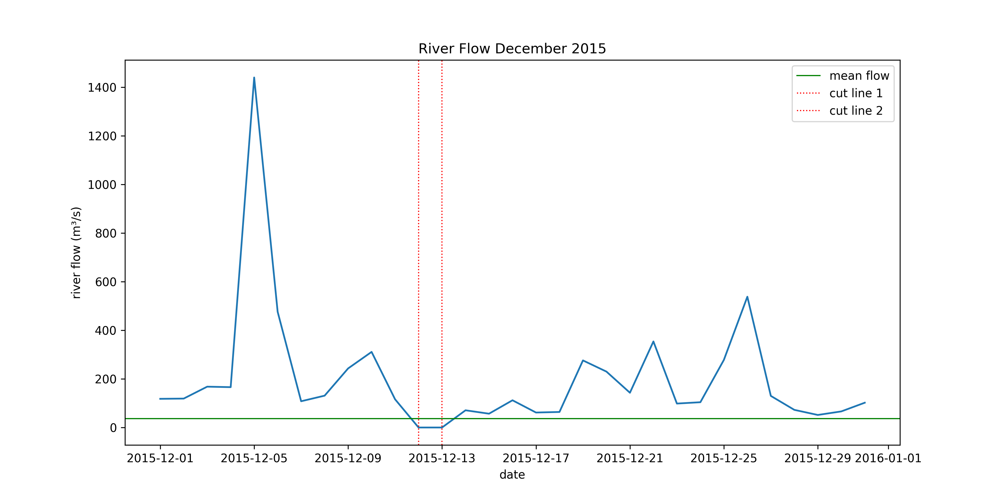
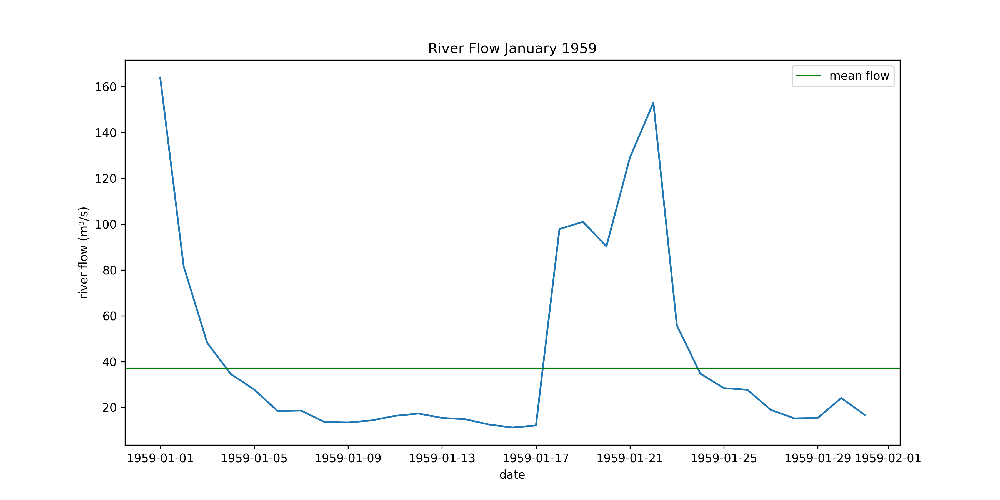
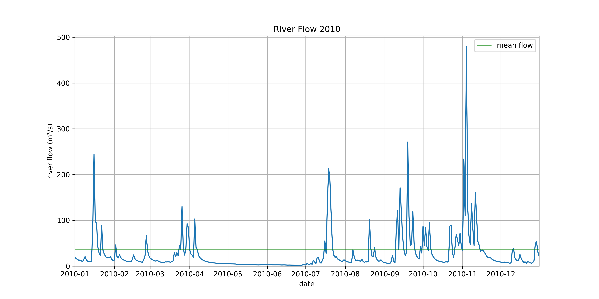
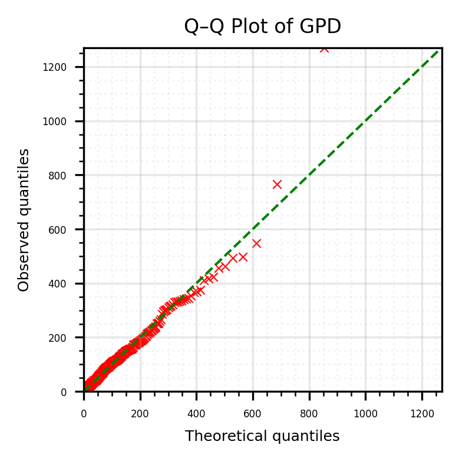

# flood-risk-analysis
How can we calculate probabilities of different flood events? This project uses a peaks over threshold approach to clean and fit probability distributions to time series from UK river height data.

## Objectives
1. Generate the n largest independent peaks over threshold from the flow data such that we include on average 5 peaks per year
2. Fit a generalised Pareto distribution to the data
3. Assess the fit

## Methodology

1. We will find all peaks in the time series data and then subject them to the standard independence tests  of the UK Centre for Ecology & Hydrology - see page 276 of the Flood Estimation Handbook Volume 3 Statistical procedures for flood frequency estimation [linked at the bottom of this webpage](https://www.ceh.ac.uk/data/software-models/flood-estimation-handbook). We need independent flood events to apply our limiting theorem (below), just like in the CLT how we need iid random variables. Then filter out smaller peaks so that the n largest independent peaks remain, where n is 5 times the number of years of data.

2. We use the [Pickands-Balkema-de Haan theorem](https://en.wikipedia.org/wiki/Pickands%E2%80%93Balkema%E2%80%93De_Haan_theorem) as a limiting theorem for threshold probabilities, ie probabilities of the form:

$$
F(y) = P(X - u \leq y \mid X > u)
$$

u is the threshold (in peaks over threshold), X is a random variable whose distribution we don't know

It states the distribution above is well approximated by a [generalised Pareto distribution](https://en.wikipedia.org/wiki/Generalized_Pareto_distribution) (for large u). It's like a CLT for conditional excess ditributions (F(y) above). 

The generalised Pareto distribtion (GPD) is fit to the data using the MLEs.

3. We test the fit using Kolmogrov-Smirnov test with bootstrapping (because we've "trained" our model on the same data we're about to test its fit with). 

### Data processing



As we can see, data from all of 1977 and 1978 is missing (is confirmed in the code). We need to look at the data from the end of 1976 and the start of 1979. If it looks like we are in the vicinity of a peak there, it may be necessary to also remove this peak from the dataset, as we do not know what the behaviour of the peak was like over when we move over the cut line. There is not much hope in analytically continuing the time series due to the high level of uncertainty in metereological effects that we would have to consider.





Treating high river flow periods (floods) as independent events, our worry might be that the 1977 or 1978 cut would be in the middle of a flood. If this happened, what remained of these flood events in the time series would have to be removed because there would be uncertainty about the behaviour of the flood event when there weren't records (during 1977-1978). We wouldn't know how high the river flow peaked at, and therefore what peak flow to record when extracting the peaks. As it turns out, the last and first (respectively) flows of 1977 and 1978 are not part of flood events as can be seen in the graphs.



Similarly for the missing values in 2015.



However it is necessary to remove the flood event at the very beginning of the dataset. The cut at the end of the dataset, like the cuts for 1977 and 1978, is fine. 

The Flood Estimation Handbook gives these as the tests for independence:

Test 1: "The two peaks must be separated by at least three times the average time to rise." 
Test 2: "The minimum discharge in the trough between two peaks must be less than two-thirds of the discharge of the first of the two peaks." 

The average time to rise is calculated by taking the mean of the time from trough to peak for all candidate single (ie not multi) peaks and is reflective of how quick an independent rain event turns into an independent flood event based on the nearby water table, geology etc... This suggests the following algorithm:

1. Find all peaks
2. Subject these peaks to independence tests, if a peak fails an independence test, remove it from the dataset
3. Choose a threshold that has on average 5 peaks over the threshold per year

Test 1 is hard to implement. How do we calculate any single "time to rise"? Using guidance from the Flood Estimation Handbook, we find n single-peaked events, find their time to rise, and average them. To calculate a single-peaked time to rise we look at the closest previous trough and the peak and find the time between them. We'll define a single peaked event as having its two neighbouring troughs below the mean flow rate of the river, ie back to normal river flow behaviour. The figure below should justify this working:



We can see single-peaked events typically have neighbouring troughs that are below the mean flow rate.

### Distribution fitting

The GPD has three parameters; shape ($\xi$), location ($\mu$), and scale ($\sigma$)

$$
F_{\mu,\sigma,\xi}(x)=
\begin{cases}
1-\left(1+\xi\frac{x-\mu}{\sigma}\right)^{-1/\xi}, & \text{for } \xi \neq 0,\\[1.2em]
1-\exp\left(-\frac{x-\mu}{\sigma}\right), & \text{for } \xi = 0.
\end{cases}
$$

For the peak data, location parameter is the threshold. Changing all the peak data to peak data over threhold, we've effectively fixed the location paramter to 0. This helps with simplifying solving for the MLEs of the shape and scale parameters. Solving for MLEs the standard way by taking partial derivatives of the log-likelihood:

$$
\ell(\sigma,\xi;\mathbf{x})
=-n\log \sigma-\left(\frac{1}{\xi}+1\right)\sum_{i=1}^n
\log\!\left(1+\xi \frac{x_i}{\sigma}\right).
$$

The system:

$$
\frac{\partial \ell}{\partial \sigma}
=
-\frac{n}{\sigma}
+
\frac{1+\xi}{\sigma}
\sum_{i=1}^{n}
\frac{x_i}{\sigma+\xi x_i}
=0.
$$

and

$$
\frac{\partial \ell}{\partial \xi}
=
\frac{1}{\xi^2}
\sum_{i=1}^{n}
\log\left(1+\frac{\xi x_i}{\sigma}\right)
-
\left(1+\frac{1}{\xi}\right)
\sum_{i=1}^{n}
\frac{x_i}{\sigma+\xi x_i}
=0.
$$

Has no closed form expression for the solution. Therefore solution by numerical approximation is used in scipy to solve for the shape and scale MLEs given the data. 

### Statistical tests

We want to use a Kolmogrov-Smirnov (KS) test to assess the fit of the GPD model to the data. But the model's been trained on the data we then want to test it on, this would not be a proper test of the fit of the data. It would be like testing an ML model on the same dataset as it was trained on; what you really want to know is whether the model holds up on other, similar datasets. 

The solution is use bootstrapping
1. Generate lots of random samples from the fitted GPD
2. Fit new GPDs to each of these samples
3. Calculate the KS statistic for each of the new samples and GPDs
4. Compare to the original GPD KS statistic
The idea is that if the KS statistic for the bootstrap samples is very frequently (more than 95%, p-value less than 0.05) less than the original KS statistic, then the original GPD fit is not actually that great of a fit for the data. 

## Results

We get a p-value of 0.293 > 0.05, therefore there is insufficient evidence to believe the original GPD with the MLE parameters is not an appropriate fit for the data. So our model is a good fit. To justify this further, here is a Q-Q plot:



The model looks like a very good fit, apart from one extreme outlier. However this is an extreme value of an extreme value, so far off in the tail of the original distribution of peak heights that it is likely going to look unusual. There are only 1-2 of these extreme of extreme events which is such a small sample that it is not overly worrying it doesn't lie on the line.

We could do more analysis to assess to assess the fit however: perturb the shape parameter (controls the decay); try higher thresholds (meaning better approximation of GPD model); remove it as an outlier from the dataset (if we had reason to believe the river gauge could not accurately report this large of a river flow). 

## Data

The project analyses river flow data from the UK National River Flow Archive (NRFA).

You can download the data from:
Lune at Caton: https://nrfa.ceh.ac.uk/data/station/meanflow/72004

Data are provided by the UK Centre for Ecology & Hydrology (UKCEH) and are subject to the Open Government Licence v3.0. See:
https://www.nationalarchives.gov.uk/doc/open-government-licence/version/3/

Raw data should be downloaded directly from NRFA.

## Installation

Clone the repository:

```bash
git clone git@github.com:yourusername/flood-frequency-analysis.git
```